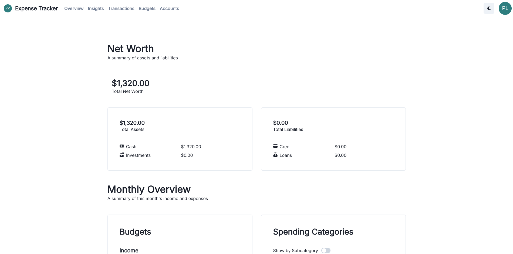

# Expense Tracker

A personal expense-tracking web application. Built with React.js, Express, Node.js, and DynamoDB.

Account transaction data provided by the [Plaid API](https://plaid.com/docs/).

## How to Run

### Development

To run the UI locally, run:

```bash
# ./client
npm start
```

The UI will be available at http://localhost:3000.

To run the server locally, run:

```bash
# ./server
tsx server.ts
```

The server will be available at http://localhost:8080

### Deploying

The client directory is synced with Vercel to automatically deploy `master`.

To compile the server to deploy to AWS Lambda, run:

```bash
# ./server
npx esbuild lambda.ts --bundle --platform=node --format=cjs --outfile=index.js
zip server.zip index.js
```

Then upload the `server.zip` to Lambda.

## Screenshots




