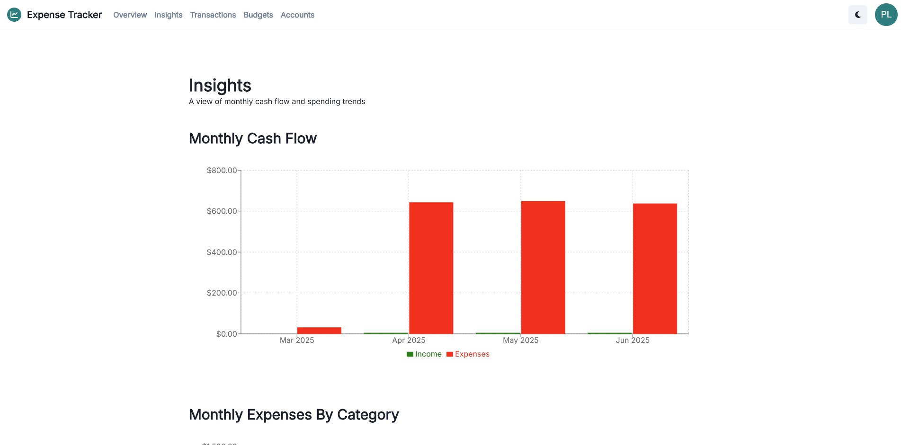
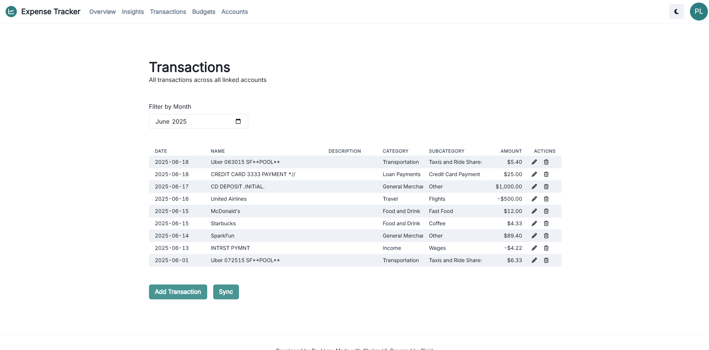
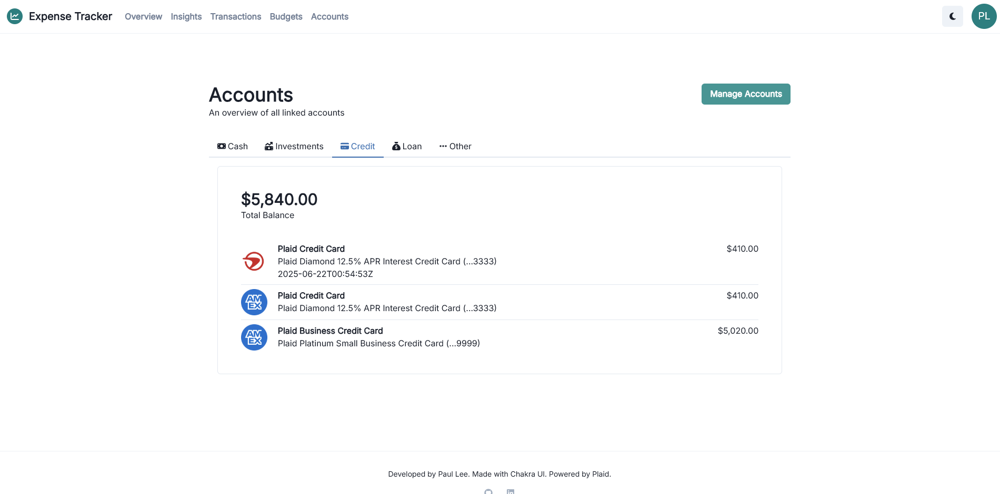

# Expense Tracker

A personal expense-tracking web application. Built with React.js, Express, Node.js, and PouchDB.

Account transaction data provided by the [Plaid API](https://plaid.com/docs/).

## How to Run

### Development

```bash
# ./client
npm start

# ./server
tsx server.ts
```

App will be available at http://localhost:3000.

### Production

```bash
# ./client
npm run build

# ./server
tsx server.ts
```

App will be available at http://localhost:8080.

## Screenshots





